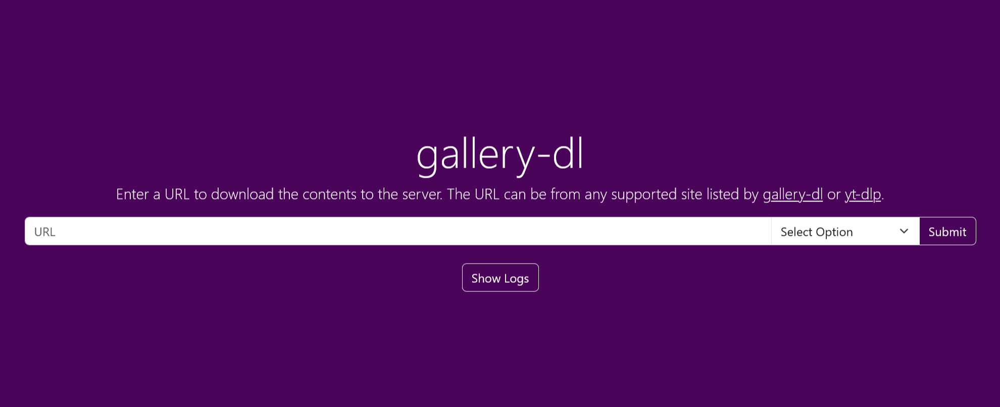

# gallery-dl-server

Web UI for [`gallery-dl`](https://github.com/mikf/gallery-dl) with support for downloading videos via [`yt-dlp`](https://github.com/yt-dlp/yt-dlp).



## Running

### Docker CLI

This example uses the `docker run` command to create the container to run the app.

```shell
docker run -d \
  --name gallery-dl-server \
  --user 1000:1000 \
  -p 9080:9080 \
  --mount type=bind,source="/path/to/config/gallery-dl.conf",target=/etc/gallery-dl.conf,readonly \
  --mount type=bind,source="/path/to/downloads/gallery-dl",target=/gallery-dl \
  --restart unless-stopped \
  qx6ghqkz/gallery-dl-server:latest
```

### Docker Compose

This is an example service definition that could be put in `docker-compose.yaml`. This service uses a VPN client container for its networking.

[Gluetun](https://github.com/qdm12/gluetun) is recommended for VPN usage. See [docker-compose.yaml](https://github.com/qx6ghqkz/gallery-dl-server/blob/main/docker-compose.yaml) for a template.

```yml
services:
  gallery-dl-server:
    image: qx6ghqkz/gallery-dl-server:latest
    network_mode: container:vpn
    user: 1000:1000
    volumes:
      - type: bind
        source: "/path/to/config/gallery-dl.conf"
        target: /etc/gallery-dl.conf
      - type: bind
        source: "/path/to/downloads/gallery-dl"
        target: /gallery-dl
    restart: unless-stopped
```

### Python

If you have Python ^3.6.0 installed in your PATH you can simply run like this.

```shell
python3 -m uvicorn gallery-dl-server:app --port 9080
```

## Configuration

Configuration of gallery-dl is as documented in the [official documentation](https://github.com/mikf/gallery-dl#configuration).

The configuration file must be mounted inside the Docker container in one of the locations where gallery-dl will check for the config file (gallery-dl.conf or config.json depending on the location).

The config location used in the examples is `/etc/gallery-dl.conf`. A default configuration file for use with gallery-dl-server has been provided ([gallery-dl.conf](https://github.com/qx6ghqkz/gallery-dl-server/blob/main/gallery-dl.conf)).

For more information on configuration file options, see [gallery-dl/docs/configuration.rst](https://github.com/mikf/gallery-dl/blob/master/docs/configuration.rst).

Any additional directories specified in configuration files must also be mounted inside the Docker container, for example if you specify a cookies file location then make sure that file is accessible from inside the Docker container.

## Usage

### Start a download remotely

Downloads can be triggered by supplying the `{{url}}` of the requested video through the Web UI or through the REST interface via curl, etc.

#### HTML

Just navigate to `http://{{host}}:9080/gallery-dl` and enter the requested `{{url}}`.

#### Curl

```shell
curl -X POST --data-urlencode "url={{url}}" http://{{host}}:9080/gallery-dl/q
```

#### Fetch

```javascript
fetch(`http://${host}:9080/gallery-dl/q`, {
  method: "POST",
  body: new URLSearchParams({
    url: url
  }),
});
```

#### Bookmarklet

Add the following bookmarklet to your bookmark bar so you can conveniently send the current page URL to your gallery-dl-server instance.

```javascript
javascript:!function(){fetch("http://${host}:9080/gallery-dl/q",{body:new URLSearchParams({url:window.location.href}),method:"POST"})}();
```

## Implementation

The server uses [`starlette`](https://github.com/encode/starlette) for the web framework and [`gallery-dl`](https://github.com/mikf/gallery-dl) to handle the downloading. The integration with gallery-dl uses Python as described [here](https://github.com/mikf/gallery-dl/issues/642).

The Docker image is based on [`python:alpine`](https://registry.hub.docker.com/_/python/) and consequently [`alpine`](https://hub.docker.com/_/alpine/).

## Useful Links

### gallery-dl

- Documentation: [gallery-dl/README.rst](https://github.com/mikf/gallery-dl/blob/master/README.rst)
- Configuration options: [gallery-dl/docs/configuration.rst](https://github.com/mikf/gallery-dl/blob/master/docs/configuration.rst)
- List of supported sites: [gallery-dl/docs/supportedsites.md](https://github.com/mikf/gallery-dl/blob/master/docs/supportedsites.md)

### yt-dlp

- Documentation: [yt-dlp/README.md](https://github.com/yt-dlp/yt-dlp/blob/master/README.md)
- List of supported sites: [yt-dlp/supportedsites.md](https://github.com/yt-dlp/yt-dlp/blob/master/supportedsites.md)
- List of extractors: [yt-dlp/yt_dlp/extractor/_extractors.py](https://github.com/yt-dlp/yt-dlp/blob/master/yt_dlp/extractor/_extractors.py)

### Issues

- [gallery-dl/issues/642](https://github.com/mikf/gallery-dl/issues/642)
- [gallery-dl/issues/1680](https://github.com/mikf/gallery-dl/issues/1680)
